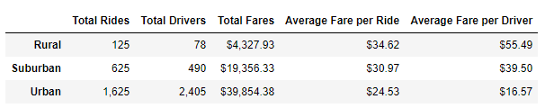
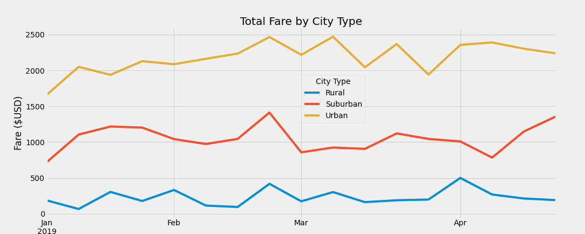

# PyBer_Analysis
## Resources 
Jupyter Notebook, Pandas Library, Matplotlib, Python 3.7

City Data: [city_data.csv](Resources/city_data.csv)

Ride Data: [ride_data.csv](Resources/ride_data.csv)

Challenge Code: [PyBer_Challenge.ipynb](PyBer_Challenge.ipynb)

## Overview of the Project

The purpose of this assignment was to perform rideshare data analysis and data visualization for PyBer. Pandas was used to create a summary DataFrame of the ride-sharing data by city tyoe (i.e. Urban, suburban, or rural). Then, a multiline graph was created using pandas and matplotlib to display the total weekly fares for each city type. 

## Results 

### Summary Analysis Table

From the summary analysis table, there is a clear difference in the ride-sharing data based on city type. Urban cities have the highest number of rides, resulting in the highest number of drivers to meet the demand. This is expected as urban cities have a higher population. Rural cities have the lowest number of rides and drivers, which can also be linked to their relatively smaller population. As the population of suburban cities is between that of rural and urban cities, it is expected and observed in the table that their total number of rides and drivers are in the middle. 

The total fares per city type also provides a similar trend where urban cities have the highest total fare value due to having the highest number of total rides. Suburban cities are in the middle and rural cities have the lowest total fare value as there are less rides. 

When observing the total rides with respect to the average fare per ride, although urban cities have the highest number of total rides (1625), this city type has the lowest average fare per ride ($24.53). In contrast, rural cities have the lowest number of total rides (125) and the highest average fare per ride ($34.62). Once again, Suburban cities are in the middle with their total number of rides (625) and average fare per ride () between that of rural and urban cities ($30.97).

Lastly, the average fare per driver has a same trends as the average fare per ride. Rural cities have the highest fare per driver ($55.49), followed by Suburban cities ($39.50), and urban cities with the lowest fare per driver ($16.57). 

## Summary 

From the multiline graph displaying the total fares obtained from January to April of 2019, it is clear that PyBer was busiest at the third week of February. Knowing this now allows PyBer to expect a higher volume of customers in this time from all city types and to plan accordingly with appropriate drivers. Additionally, by the end of April, it is shown that urban and suburban cities steadily increase in their total fares, resulting in more rides. This could be due to the change in seasons from winter to spring. To promote more business in the January, one suggestion is to provide a discount or bonus incentive for riders, making it more attractive to use PyBer during those times. Another suggestion is to decrease the amount of drivers in urban areas. Urban cities is the only city type where the number of drivers (2405) is higher than the number of rides (1625). This means that although urban cities does have a higher demand for drivers, they are already saturated with enough drivers to meet demand and therefore, some can be removed to save cost. 

